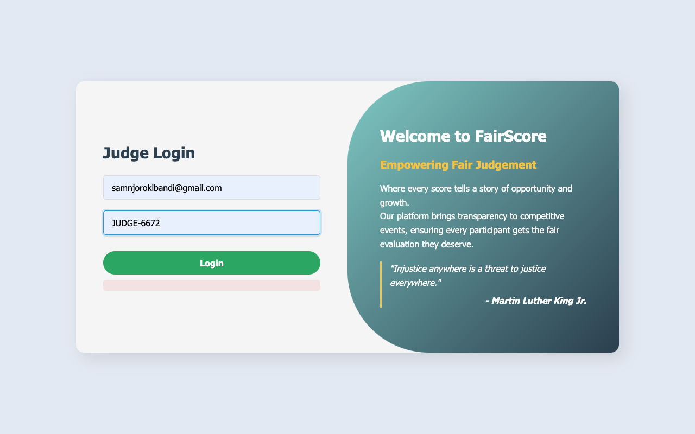
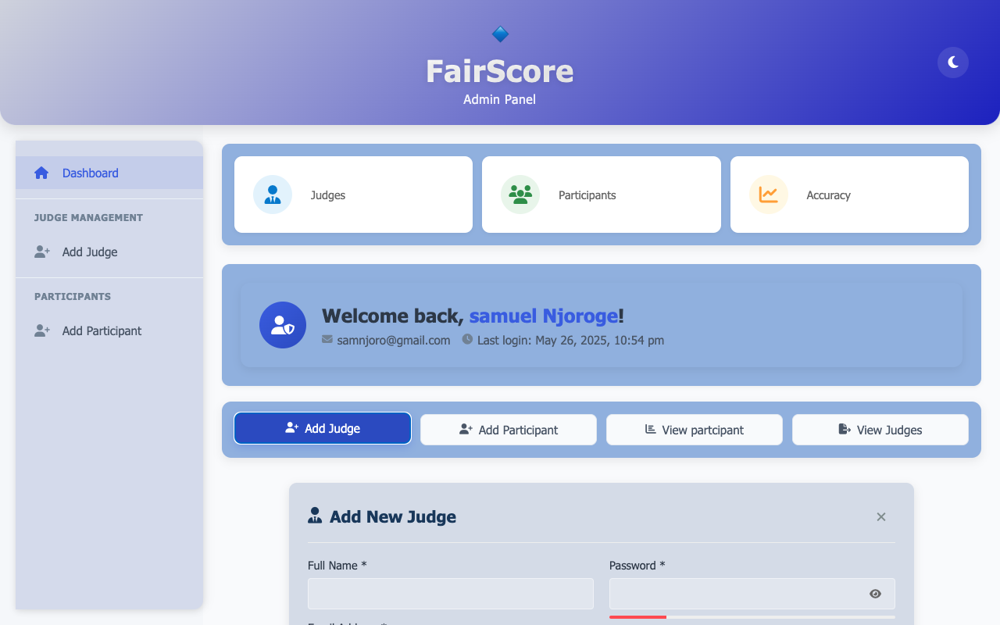
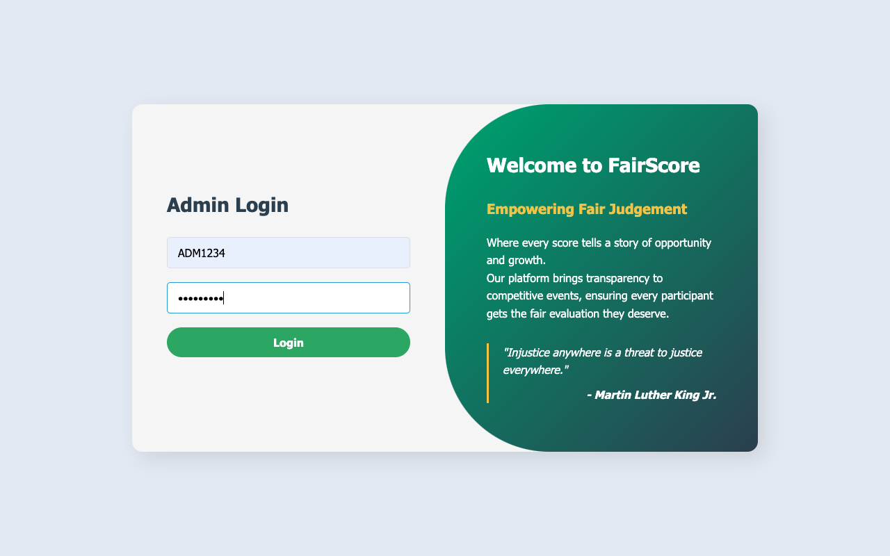
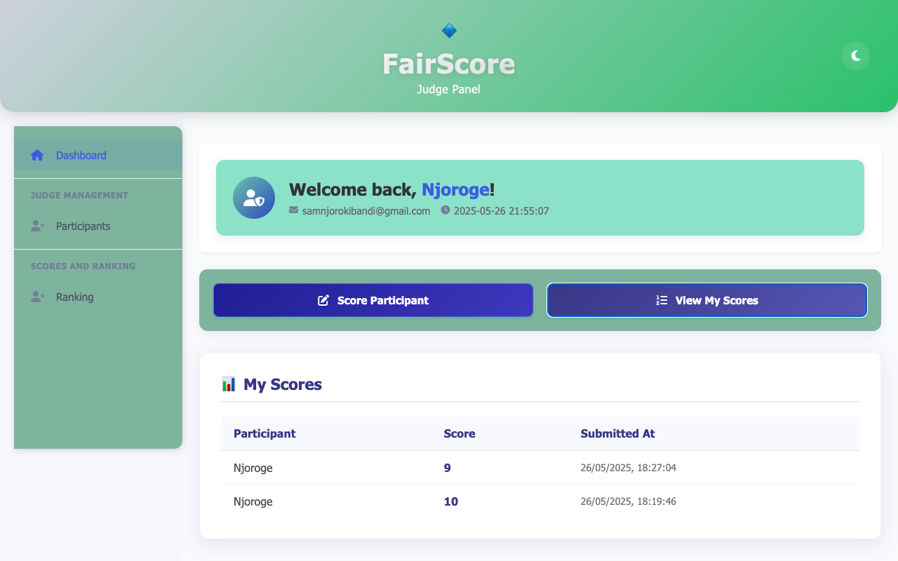
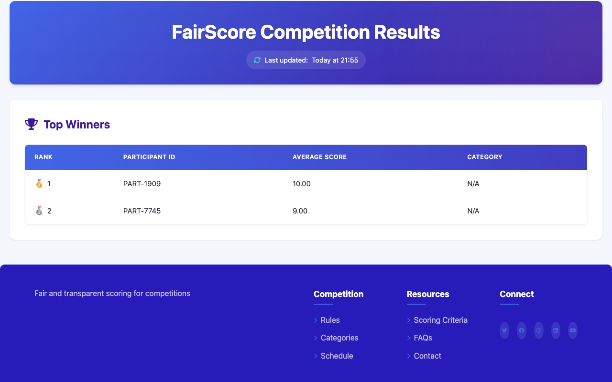

# FairScore - Competition Scoring System


FairScore is a comprehensive competition scoring system with admin, judge, and public interfaces for managing participants, scoring, and displaying results.

## Features

- **Admin Panel**: Manage judges and participants
- **Judge Panel**: Score participants and view rankings
- **Public Scoreboard**: Real-time competition results
- **User Management**: Secure authentication for admins and judges

## System Architecture

### Frontend
- HTML5, CSS3, JavaScript
- Responsive design for all devices
- Clean, intuitive interfaces for each user type

### Backend
- PHP for server-side logic
- MySQL database
- RESTful API design

## Database Structure

```sql
-- Sample database schema
CREATE TABLE judges (
    judge_id VARCHAR(20) PRIMARY KEY,
    full_name VARCHAR(100) NOT NULL,
    email VARCHAR(100) UNIQUE NOT NULL,
    phone VARCHAR(20),
    password_hash VARCHAR(255) NOT NULL,
    created_at TIMESTAMP DEFAULT CURRENT_TIMESTAMP
);

CREATE TABLE participants (
    participant_id VARCHAR(20) PRIMARY KEY,
    full_name VARCHAR(100) NOT NULL,
    email VARCHAR(100) UNIQUE NOT NULL,
    phone VARCHAR(20),
    created_at TIMESTAMP DEFAULT CURRENT_TIMESTAMP
);

CREATE TABLE scores (
    score_id INT AUTO_INCREMENT PRIMARY KEY,
    judge_id VARCHAR(20) NOT NULL,
    participant_id VARCHAR(20) NOT NULL,
    score INT CHECK (score BETWEEN 0 AND 10),
    created_at TIMESTAMP DEFAULT CURRENT_TIMESTAMP,
    FOREIGN KEY (judge_id) REFERENCES judges(judge_id),
    FOREIGN KEY (participant_id) REFERENCES participants(participant_id)
); 
```

## DESIGN
 - frontend folder and backend folder
 - js and css in frontend are on there folderss
 
 # FairScore - Competition Scoring System
## Summary

### Core Components
1. **Admin Panel**  
   - URL: `http://localhost/fairscore/frontend/admin/login.html`  
   - Credentials: `ADMIN1234` / `@Admin254`  
   - Features:  
     - Add/manage judges & participants  
     - View lists (judges/participants)  
     - Dashboard with stats  

2. **Judge Panel**  
   - URL: `http://localhost/fairscore/frontend/judge/login.html`  
   - Login: Email + Judge ID (admin-registered)  
   - Features:  
     - Score participants (0-10 scale)  
     - View submitted scores  

3. **Public Scoreboard**  
   - URL: `http://localhost/fairscore/frontend/scoreboard/index.html`  
   - Auto-refreshes every minute to show latest results  

## Technical Stack
- **Frontend**: HTML5, CSS3, JavaScript (modular components)
- **Backend**: PHP + MySQL
- **Security**: Password hashing, role-based access control

## Key Features
- Real-time score updates
- Auto-generated unique IDs for judges/participants
- Responsive design for all devices
- Intuitive admin and judge interfaces

## Installation
1. Clone repository to XAMPP `htdocs` folder
2. Import provided SQL database schema
3. Configure database credentials in `backend/config.php`

## Future Improvements
- Admin score verification system
- Advanced analytics dashboard
- Email notifications
- Multiple competition categories support

## Screenshots

<div align="center">
  
  
  <br>
  
  
  <br>
  
</div>